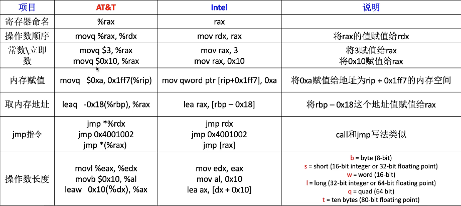
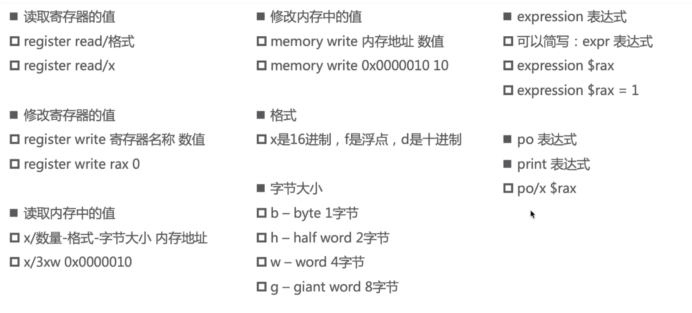
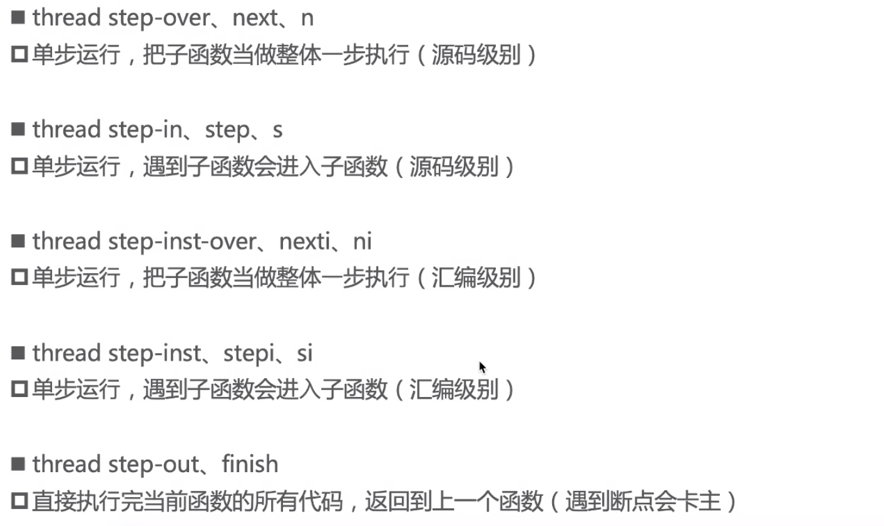

### 原始值和关联值

1. 在swift中查看内存的工具[Mems](https://github.com/CoderMJLee/Mems)

2. 简单的枚举、带原始值的枚举

   ```swift
   enum testEnum {
       case test1, test2, test3, test4
   }
   var test = testEnum.test2
   print(Mems.ptr(ofVal: &test))
   print(Mems.size(ofVal: &test))
   print(Mems.memBytes(ofVal: &test))
   print("123")
   ```

   像这种简单的枚举, 占一个字节, 只需要来标识是哪个case就够了, 一个字节0x00~0xFF, 可以标识256个有效数字, 可以标识256个case, 那超过256呢, 超过256也就没必要使用枚举了

   ---

   ```swift
   enum testEnum: Int {
       case test1 = 1, test2, test3, test4
   }
   var test = testEnum.test2
   print(Mems.ptr(ofVal: &test))
   print(Mems.size(ofVal: &test))
   print(Mems.memBytes(ofVal: &test))
   print("123")
   ```

   带原始值的枚举, 其变量的内存跟原始值的类型没有半毛钱关系, 原始值不会保存在枚举变量中, 这里虽然原始值是Int类型, 但是变量还是占一个字节, 来标识是哪个case
   
3. 带关联值的枚举

   ```swift
   enum testEnum {
       case test1(Int, Int, Int)
       case test2(Int, Int)
       case test3(Int)
       case test4(Bool)
       case test5
   }
   var e = testEnum.test1(1, 2, 3)
   e = .test2(4, 5)
   e = .test3(6)
   e = .test4(true)
   e = .test5
   
   print(MemoryLayout.stride(ofValue: e))//32
   print(MemoryLayout.size(ofValue: e))//25
   print(MemoryLayout.alignment(ofValue: e))//8
   ```
   
   可以看到, 不管怎么给枚举赋值, 其占内存都是25个字节, 其中24个字节用来存放做多的三个Int类型的test1的case, 还有一个字节用来区分是哪个case
   
   - 小端模式, 高高低低, 数据的高字节保存在内存的高地址中, 数据的低字节保存在内存的底地址中, 下方内存地址 低->高
   
   - .test1(1, 2, 3):
   
     ```swift
     1, 0, 0, 0, 0, 0, 0, 0,
     2, 0, 0, 0, 0, 0, 0, 0,
     3, 0, 0, 0, 0, 0, 0, 0,
     0
     ```
   
   - .test2(4, 5):
   
     ```swift
     4, 0, 0, 0, 0, 0, 0, 0,
     5, 0, 0, 0, 0, 0, 0, 0,
     0, 0, 0, 0, 0, 0, 0, 0,
     1
     ```
   
   - .test3(6):
   
     ```swift
     6, 0, 0, 0, 0, 0, 0, 0,
     0, 0, 0, 0, 0, 0, 0, 0,
     0, 0, 0, 0, 0, 0, 0, 0,
     2
     ```
   
   - .test4(true):
   
     ```swift
     1, 0, 0, 0, 0, 0, 0, 0,//true是1, false是0
     0, 0, 0, 0, 0, 0, 0, 0,
     0, 0, 0, 0, 0, 0, 0, 0,
     3
     ```
   
   - .test5:
   
     ```swift
     0, 0, 0, 0, 0, 0, 0, 0,
     0, 0, 0, 0, 0, 0, 0, 0,
     0, 0, 0, 0, 0, 0, 0, 0,
     4
     ```
   
4. 特别的

   - 只有一个case的枚举

     ```swift
     enum testEnum {
         case test
     }
     print(MemoryLayout<testEnum>.size)//0
     print(MemoryLayout<testEnum>.stride)//1
     print(MemoryLayout<testEnum>.alignment)//1
     ```

     没有必要分配内存来区分是哪个case

   - 只有一个case, 带关联值的枚举

     ```swift
     enum testEnum {
         case test(Int)
     }
     print(MemoryLayout<testEnum>.size)//8
     print(MemoryLayout<testEnum>.stride)//8
     print(MemoryLayout<testEnum>.alignment)//8
     ```

     只需要分配给关联值一个Int占的内存8个字节,  只有一个case, 不需要区分是哪个case, 也就不需要额外一个字节来区分了

### switch语句中使用枚举的底层实现

1. switch会去查找当前枚举变量的成员值, 即保存着是哪一个case的一个字节, 看它符合哪个case, 则跳转到对应的代码块执行

### 汇编指令

1. moveq 赋值地址存储的值

   leaq 赋值地址值

   jmp 跳转, 不回头

   callq 配合retq使用, 结束后会返回原位置继续执行

   跳进callq函数里面或者下一步, 用si

2. 常见汇编指令

   

3. 寄存器

   - r开头:  64bit, 8字节

   - e开头:  32bit, 4字节

   - ax, bx, cx :16bit,  2字节

   - ah al:8bit, 1字节

     bh bl
   
4. lldb常用指令

   - 

     ---

   - 

