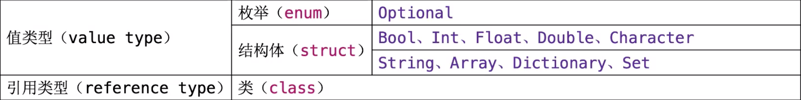

# 基础语法

## var定义变量  let 定义常量

- let只能赋值一次, 声明时要指定类型

  ```swift
  let a: Int
  a=10
  ```

- 它的值不要求编译时候确定，但要保证使用前赋值一次

  ```swift
  func getAge() ->Int{
    return 10
  }
  let age=getAge()
  printf(age)
  ```

- 常量和变量在初始化之前，都不能使用

- printf变量

  ```swift
  var a = 10
  print("Hello, World! - \(a)")
  ```


## 标识符

- 标识符不能以数字开头，不能包含空白字符、制表符、箭头等特殊字符

## 常见数据类型



- 字符类型要写清楚字符，不然会认为是字符串

  ```swift
  let character: Character = "a"
  ```

- 元组

  ```swif
  let error = (404,"Not Found")
  error.0
  error.1
  print("error is \(error)")
  ```

  ```swift
  let (statusCode, statusMsg) = error
  ```

  ```swift
  let (statusCode, _) = error
  ```

  ```swift
  let newError = (statusCode:200, MSG:"OK")
  print("newError is \(newError.statusCode)")
  ```

  